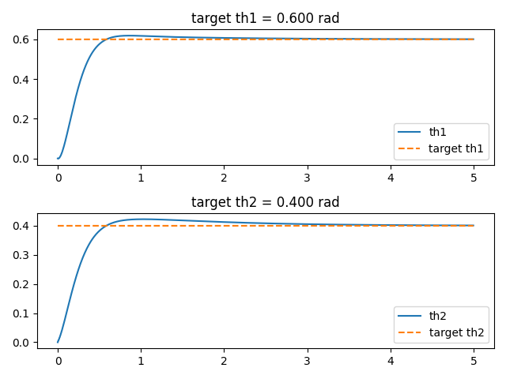
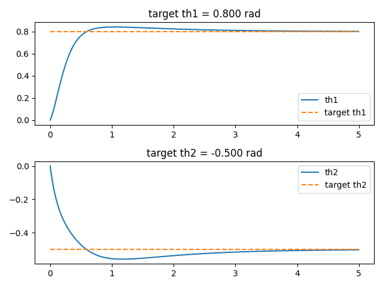
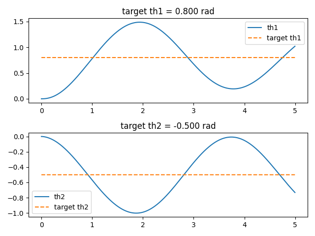
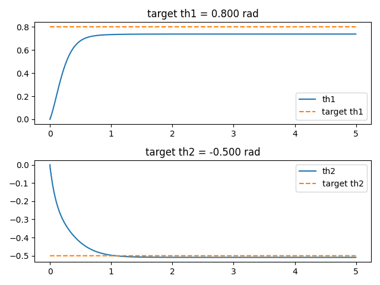
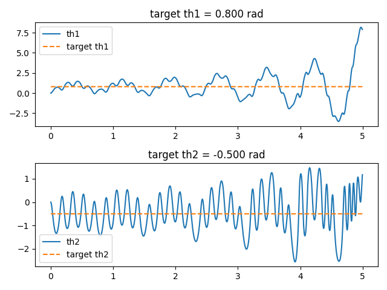

# ПИД регулятор для двойного маятника
В этом проекте исследуется модель двойного маятника — системы из двух последовательно соединённых звеньев, вращающихся в одной плоскости. Маятник смоделирован в PyBullet и описан с помощью URDF. Ставится задача управления положения маятником через крутящие моменты шарниров с целью занятия заданной позиции.
### Описание модели
Двухзвенный маятник обладает следующими характеристиками:
- Два звена
- Длина звеньев 0.8 метра
- Масса шарниров 1 кг

Изначально маятник находится в вертикальном положении с нулевыми скоростями элементнов. Позиция задается углами поворота шарниров. Для первого звена это угол относительно вертикальной оси. Для второго - относительно первого звена.
### ПИД регулятор
ПИД регулятор позволяет управлять системой с целью приведения к устойчивому состоянию в определенном положении этой системы. Он состоит из трех компонентов:
- П (Пропорциональный) - реагирует на текущую ошибку. Чем больше отклонение — тем сильнее действие.
- И (Интегральный) - реагирует на накопленную ошибку. Позволяет убрать смещение.
- Д (Дифференциальный) - учитывает скорость изменения ошибки, сглаживает рывки.

Если обозначить соответствующие коэффициенты как $$K_p, K_i, K_d$$, то виде формулы можно записать регулятор следующим образом:

$$u(t)=K_p\cdot e(t)+K_i\int_0^t e(\tau)d\tau + K_d \cfrac{de(t)}{dt}$$

Коэффициенты подбираются опытным путём.
### Результаты
Опытным путём были подобраны следующие коэффициенты:
- $$K_p = 200$$
- $$K_i = 140$$
- $$K_d = 50$$
Такие значения позволяют сохранять хорошую устойчивость при различных значениях. Ниже приведены различные примеры поведения системы в зависимости от целевого положения маятника. Пусть $$\theta_1$$ - угол отклонения первого звена, $$\theta_2$$ - угол отклонения второго звена.
Целевые значения $$\theta_1 = 0.6, \theta_2 = 0.4$$

Целевые значения $$\theta_1 = 0.8, \theta_2 = -0.5$$

Далее рассматривается зависимость устойчивости от значения коэффициентов регулятора. Неуказанные коэффициенты равны подобранным ранее.
Если $$K_p = 0,$$ то управление перестает зависить от ошибки в данный момент времени. Получается медленно затухающая периодическая функция, которая пытается быть минимальной только в пределе.

Если $$K_i = 0,$$ то при близости к целевому значению управление перестает давать достаточный импульс, соответственно значения фиксируются не достигнув целевого.

Если $$K_d = 0,$$ то управление не учитывает изменение ошибки на этом шаге, что приводит к отсутствию "замедления" шарниров при близости значений. Как следствие, система перестает быть устойчивой.

### Вывод
Разработана и протестирована модель двойного маятника в PyBullet. С помощью ПИД-регулятора успешно реализовано управление моментами, что подтвердило эффективность метода для позиционирования звеньев. Дополнительно был проведен анализ зависимости управления от коэффициентов регулятора.